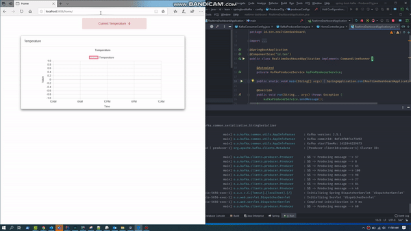

# Realtime Live Temperature

Project ini adalah tentang membuat realtime live temperature yang data nya di buat secara random antara nilai 1 dan 100 dengan perubahan data setiap 1 detik.  Adapun flow dari aplikasi ini adalah :

1. Produce random data ke kafka
2. Consume data dari kafka 
3. kemudian meneruskan data tersebut ke client menggunakan websocket

**Prerequisites**

Sebelum mencoba repo ini pastikan local anda sudah terinstall :

1. OpenJDK 11
2. Kafka Local
3. Inteljidea atau Spring Tool Suite as IDE
4. Kafka Tool / Conduktor (Optional)

Setelah anda menjalankan **zookeeper** dan **kafka server** nya buatlah dua topic berikut :

> kafka-topics --zookeeper 127.0.0.1:2181 --topic live-temperature --create --partitions 1 --replication-factor 1

dalam project ini saya menggunakan kafka secara local

### **How to use it ?**

1. Pastikan zookeeper dan kafka server sudah running
2. Pastikan topic **live-temperature** 
3. git clone https://github.com/teten-nugraha/realtime-dashboard.git 
4. mvn clean install
5. mvn spring-boot:run atau running menggunakan IDE
6. Buka browser dan ketika localhost:5656/home

